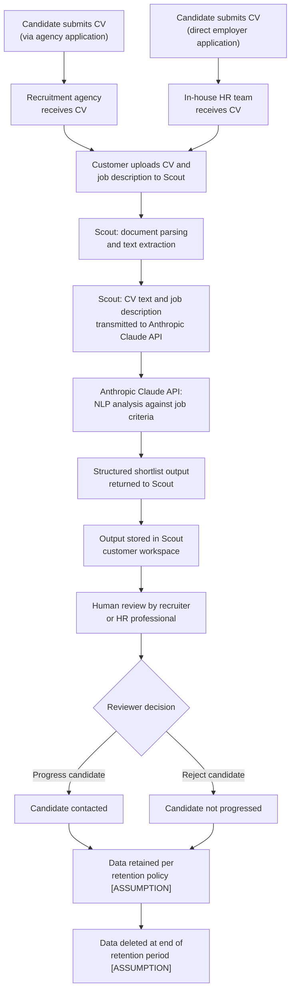

# Data Flow Map — Scout CV Screening Workflow
**Project:** Sable AI Ltd — AI Governance Framework
**Stage:** Stage 2 — Governance Foundation
**Status:** Draft
**Version:** v1
**Date:** 2026-03-01
**Assumptions:** Built on outline assumptions — not verified against real Sable AI Ltd data

---

## 1. Purpose of This Document

This document maps the end-to-end data flow for Scout's CV screening and candidate shortlisting workflow. It covers:

- The two customer data paths (recruitment agency; in-house HR)
- The Anthropic Claude API sub-processor data path
- The candidate data lifecycle from ingestion to deletion
- The controller/processor relationship analysis for each path

It is the basis for DPIA data flow sections (`L2-3.4-DPIA-Template-v1.md`), the customer DPA templates (`L4-5.1-Data-Processing-Agreement-Template-v1.md`), and the UK GDPR mapping matrix (`L2-3.1-UK-GDPR-Mapping-Matrix-v1.md`).

All technical fields are populated from assumed company characteristics. `[ASSUMPTION]` markers identify unverified fields.

---

## 2. End-to-End Data Flow — Diagram

---

## 3. Data Flow Steps — Detailed Table

| Step | Actor | Action | Data in transit | Data stored | Notes |
|---|---|---|---|---|---|
| **1** | Candidate | Submits CV and application | CV document; personal contact details; covering information | Held by customer (agency or employer) | Outside Scout's processing scope — governed by customer's own data protection obligations |
| **2** | Customer | Uploads CV and job description to Scout | CV document or text; job description | Ingested into Scout platform [ASSUMPTION] | Scout's processing begins at this point |
| **3** | Scout | Document parsing and text extraction | CV document → extracted text | Extracted text within Scout [ASSUMPTION] | Raw document file handling — confirm whether Scout stores the original document or text only |
| **4** | Scout → Anthropic | CV text and job description transmitted to Anthropic Claude API | Extracted CV text; job description text [ASSUMPTION — A-011] | Transient — in API request only; not persistently stored by Anthropic [ASSUMPTION — A-005] | International transfer: Anthropic processing likely occurs outside UK [ASSUMPTION] — see §5 |
| **5** | Anthropic Claude API | NLP analysis of CV against job description criteria | CV text + job description (held in API context during processing) | Not retained post-response [ASSUMPTION — A-005] | Anthropic acts as sub-processor; no model training on candidate data [ASSUMPTION — A-005] |
| **6** | Anthropic → Scout | Structured shortlist output returned | Structured assessment output; ranking or suitability indicators [ASSUMPTION] | Returned to Scout and stored in customer workspace [ASSUMPTION] | Output content depends on Scout's prompt design — not confirmed |
| **7** | Scout | Output stored and presented to recruiter | — | Shortlist output + original CV in Scout customer workspace [ASSUMPTION] | Access controls — confirm who can view candidate data within customer workspace |
| **8** | Recruiter / HR professional | Human review of Scout output | Shortlist output viewed; CV reviewed [ASSUMPTION] | Reviewer actions / notes [ASSUMPTION] | Meaningful review required — see `L1-2.2-Risk-Classification-Framework-v1.md` §2 |
| **9** | Recruiter / HR professional | Decision: progress or reject candidate | Decision outcome | Logged within Scout or customer system [ASSUMPTION] | Human decision — this is the point at which Art. 22A analysis is determinative |
| **10** | Scout / customer | Data retained per retention policy | — | CV, shortlist output, decision record [ASSUMPTION] | Retention period not confirmed [ASSUMPTION — A-012] |
| **11** | Scout / customer | Data deletion at end of retention period | — | Data deleted from Scout and customer systems [ASSUMPTION] | Deletion mechanism and verification not confirmed [ASSUMPTION] |

---

## 4. Customer Path Analysis

### 4.1 Path A — Recruitment Agency Customer

**Scenario:** A UK recruitment agency uses Scout to screen candidates on behalf of employer clients. The agency has received CVs from candidates applying for positions at the employer client.

**Data flow specifics:**
- Candidate submitted CV to the agency (or via job board) in the context of a specific job application
- Agency uploads CV to Scout — this is the point at which Sable AI Ltd begins processing candidate personal data
- Scout output (shortlist) is reviewed by agency recruiter before being shared with employer client
- Employer client makes the final hiring decision based on the agency's recommendation

**Controller / processor question:**

This path presents the most complex data protection arrangement and requires legal review.

| Party | Possible role | Basis | Issue |
|---|---|---|---|
| **Employer client** | Controller | The employer determines the ultimate purpose — hiring for a specific role — and sets the criteria | If the employer determines purposes, the agency may be a processor (or sub-processor) rather than a separate controller |
| **Recruitment agency** | Controller or joint controller or processor | The agency determines how to screen candidates (including using Scout) and controls day-to-day processing | If the agency independently determines processing purposes, it is a controller or joint controller alongside the employer |
| **Sable AI Ltd** | Processor | Sable AI processes candidate data only on the instruction of the agency customer | This role is consistent across both possible agency arrangements above |
| **Anthropic PBC** | Sub-processor | Anthropic processes candidate data (via the Claude API) only within Scout's instruction | Anthropic is a sub-processor to Sable AI Ltd |

**Key unresolved question:** Where the agency screens on behalf of an employer client, are the agency and employer **joint controllers** under UK GDPR Art. 26 (both determining the purposes and means of processing), or is the employer the sole controller with the agency acting as processor?

This is not a structural decision — it depends on the contractual arrangements and actual operational conduct between the agency and employer. It has material implications for the DPA template (`L4-5.1-Data-Processing-Agreement-Template-v1.md`). [LEGAL REVIEW REQUIRED]

> **[ASSUMPTION — A-008]:** For the purposes of this framework, Sable AI Ltd is treated as a data processor to its agency customers. The agency-employer relationship is flagged as unresolved.

### 4.2 Path B — In-house HR Customer

**Scenario:** A corporate HR team uses Scout directly for hiring into the employer's own organisation.

**Data flow specifics:**
- Candidate applies directly to the employer (via careers site, job board, or direct application)
- HR team uploads CV to Scout for screening against a specific vacancy
- Scout output reviewed by HR professional before any candidate is contacted
- Employer makes hiring decision

**Controller / processor arrangement:**

| Party | Role | Basis |
|---|---|---|
| **Employer (corporate HR customer)** | Controller | The employer determines the purpose (hiring for their organisation) and means of processing; they instruct Sable AI Ltd via the customer DPA |
| **Sable AI Ltd** | Processor | Processes candidate data only on the employer's instruction, under the terms of the customer DPA |
| **Anthropic PBC** | Sub-processor | Processes candidate data via the Claude API within Scout's instruction chain |

This is the simpler arrangement. The employer-as-controller / Sable-as-processor structure is standard and governs the customer DPA template (`L4-5.1-Data-Processing-Agreement-Template-v1.md` — Appendix B).

---

## 5. Anthropic Sub-Processor Data Path

| Element | Detail | Status |
|---|---|---|
| **What is sent to Anthropic** | Extracted CV text and job description text [ASSUMPTION — A-011] | Unverified — confirm Scout's API payload |
| **What is received from Anthropic** | Structured assessment output, ranking or suitability indicators [ASSUMPTION] | Unverified — confirm API response format |
| **Data minimisation** | Only text content necessary for assessment is transmitted — no raw document binaries, no additional personal data fields beyond CV content [ASSUMPTION — A-011] | Data minimisation design must be confirmed and documented |
| **Anthropic data retention** | Candidate data is not retained by Anthropic beyond the API request/response cycle [ASSUMPTION — A-005] | Must be confirmed against current Anthropic API usage policy and DPA terms |
| **Model training** | Candidate personal data submitted through Scout is not used to train Anthropic's foundation models [ASSUMPTION — A-005] | Must be confirmed against current Anthropic API usage policy |
| **Governing terms** | Anthropic API usage policy + Data Processing Agreement between Sable AI Ltd and Anthropic [ASSUMPTION — A-005] | DPA must be reviewed to confirm it addresses: sub-processing obligations; restriction on model training; breach notification; deletion on termination |
| **Anthropic processing location** | Likely USA [ASSUMPTION] | If confirmed, a UK GDPR Chapter V international transfer mechanism is required. The UK–US Data Bridge (or UK International Data Transfer Agreement / Addendum) may apply — this must be confirmed with legal advice. [LEGAL REVIEW REQUIRED] |

---

## 6. Candidate Data Lifecycle

| Lifecycle stage | Actor | Data | Retention | Notes |
|---|---|---|---|---|
| **Ingestion** | Customer → Scout | CV document / text; job description | From point of upload | Begins Sable AI Ltd's processing |
| **Active processing** | Scout + Anthropic | CV text; structured output | Duration of screening workflow | Anthropic: transient only [ASSUMPTION] |
| **Storage — active** | Scout | CV text; shortlist output; decision record | Duration of active recruitment process [ASSUMPTION] | No defined retention period confirmed [ASSUMPTION — A-012] |
| **Storage — post-decision** | Scout / customer | CV text; outcome record | Retention period [ASSUMPTION — A-012] | ICO guidance: retain only as long as necessary for the purpose |
| **Deletion** | Scout / customer | All candidate personal data | At end of retention period [ASSUMPTION] | Secure deletion mechanism not confirmed [ASSUMPTION] |
| **Anthropic — no retention** | Anthropic | Transient API data only | None — API request/response only [ASSUMPTION — A-005] | Must be contractually confirmed |

> **[ASSUMPTION — A-012]:** Sable AI Ltd has not defined a formal retention period for candidate personal data processed through Scout. UK GDPR Art. 5(1)(e) requires that personal data be kept "no longer than is necessary" for the purpose. A retention policy must be established and documented before Scout is deployed at scale.

---

## 7. Special Category Data — Flow Risk

The following points in the data flow create exposure to incidental or inferred special category data:

| Flow point | Risk | Mitigation |
|---|---|---|
| **CV text extraction (Step 3)** | CV may include disclosed health information, religious dates, ethnic names | No filtering at extraction — special category data passes into the processing chain |
| **API transmission to Anthropic (Step 4)** | Transmitted text includes any special category data present in the CV | Data minimisation in prompt design may reduce exposure but not eliminate it |
| **Claude API analysis (Step 5)** | LLM may infer protected characteristics from CV content even where not explicit | ICO: "information intentionally inferred in this way is still special category data" — prompt engineering to prevent inference does not remove the legal risk if the model processes the underlying data |
| **Shortlist output (Step 6)** | Output may reflect inferred attributes if model has used them in ranking | Bias monitoring protocol required — see `L3-4.2-Bias-Monitoring-Protocol-v1.md` (forthcoming) |

---

## 8. Assumptions Flagged in This Document

| Assumption ID | Statement | Status |
|---|---|---|
| A-005 | Candidate data is not used for Anthropic model training; DPA with Anthropic is in place | 🔴 Unverified |
| A-007 | Scout outputs are subject to mandatory human review before candidate contact | 🔴 Unverified |
| A-008 | Sable AI Ltd's primary role is as data processor to its customers | 🔴 Unverified |
| A-011 | Only extracted CV text and job description text are transmitted to the Anthropic Claude API — no raw document files or additional personal data fields | 🔴 Unverified |
| A-012 | Retention periods for candidate personal data processed through Scout have not been formally defined | 🔴 Unverified |
| A-013 | Anthropic processes Scout API requests outside the UK (likely USA) — international transfer implications apply | 🔴 Unverified |

---

## 9. Cross-References

| Document | Relationship |
|---|---|
| `L1-2.1-AI-System-Inventory-v1.md` | System profile underlying this data flow |
| `L1-2.2-Risk-Classification-Framework-v1.md` | Risk tier assigned from this data flow analysis |
| `L2-3.1-UK-GDPR-Mapping-Matrix-v1.md` (forthcoming) | UK GDPR obligations mapped against each processing activity in this flow |
| `L2-3.4-DPIA-Template-v1.md` (forthcoming) | DPIA data flow section draws directly from this document |
| `L3-4.2-Bias-Monitoring-Protocol-v1.md` (forthcoming) | Bias monitoring addresses risks identified at Steps 4–6 in this flow |
| `L4-5.1-Data-Processing-Agreement-Template-v1.md` (forthcoming) | Customer DPAs address both paths documented here |
| `L4-5.2-Candidate-Transparency-Notice-v1.md` (forthcoming) | Transparency notice covers the processing described in this flow |

---

*This document is a draft built on assumed company characteristics. The controller/processor analysis and international transfer question require legal review before any compliance conclusions are drawn. All [ASSUMPTION] fields must be validated against actual Sable AI Ltd technical architecture and contractual arrangements.*
